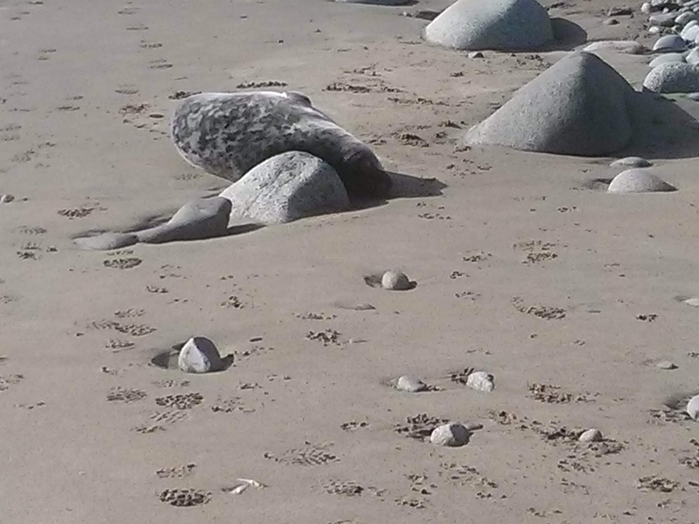

# Annotated Image
Annotated Image is a web page that displays a main image with clickable hotspots. Hotspots can also be selected by clicking on a radio button list.

Each hotspot has an associated detail image and description text.

The page is mobile-friendly and keyboard accessible.

You can customise the page title, footer HTML, images, hotspots and descriptions.

## Dependencies
The Annotated Image code includes the following:

- [jquery 3.5.1](https://code.jquery.com/jquery-3.5.1.min.js)
- [ImageMapster jquery plugin](https://github.com/jamietre/imagemapster)

## Usage
The downloaded code will work as is, and can be used as an example. However you will want to customise it for your own use. To do this, change the following:

- page details and hotspot data in ```/scripts/data.js```
- ```/main_image.jpg```
- detail images in ```/images```

### Page details
In the file ```/scripts/data.js```, modify the following:

- ```titleText```: string which is used as page header and page title
- ```footer```: html which is used as a footer

### Main image
In the project root, delete the default image ```main_image.jpg```.

Copy your main image into the project root, and name it ```main_image.jpg```. Your main image must be a JPEG file.

### Hotspot data
You will need to enter co-ordinates for each hotspot into ```/scripts/data.js```. I suggest that you use an online utility to generate the co-ordinates.

The instructions below are based on http://www.image-map.net/ but should be easily adapted for other online generators.

Go to a site with an imagemap creation utility, such as http://www.image-map.net/

Open ```main_image.jpg```.

Click the top left corner of where you want your first hotspot to be.

Then click the bottom right corner. The order is important!

Enter a title for the hotspot. This is the unique identifier for this hotspot and should not contain spaces, e.g. "seal". I suggest using the same text that you will use for the JSON property "data-item" later as it will make it easier to associate the image map with the JSON data.

You can adjust the corners of the hotspot by dragging them.

Now click "Add New Area", and then select the new area with the radio button. Now you can draw your second hotspot. Make sure the shape is "rect".

Click "Show me the code!"

Although the code in the popup is in a disabled text area, you can still highlight it with the mouse and copy it, then paste it into a text editor. You should have something like this:

```
<!-- Image Map Generated by http://www.image-map.net/ -->


<map name="image-map">
    <area target="" alt="seal" title="seal" href="" coords="395,188,967,509" shape="rect">
    <area target="" alt="rock" title="rock" href="" coords="1127,86,1544,394" shape="rect">
</map>
```

Each hotspot is defined in ```/scripts/data.js``` by a JavaScript object in the array ```areaData```. This object has the following properties:

- **data-item**: a unique string without spaces that will be used as a data key and as the detail image filename, e.g. "seal".
- **data-full**: the name and tooltip that will be shown for the item, e.g. "Grey seal".
- **coords**: copy "coords" from your image map data.
- **description**: text to describe the item. Escape special characters and use \n to enter a line break, e.g. "This is a grey seal\nIt\'s easy to mistake it for a rock."
- **file-extension**: optional. Specify a different filetype for the detail image (default .jpg).

For each hotspot you want to create, create an object in the areaData array, copy the image map coords into the object and fill in the additional properties - see the example below.

#### Example hotspot data
```
const areaData = [
	{
		'data-item': 'seal',
		'data-full': 'Grey seal',
		'coords': '395,188,967,509',
		'description': 'This is a grey seal.\nIt\'s easy to mistake it for a rock.',
	},
	{
		'data-item': 'rock',
		'data-full': 'Grey rock',
		'coords': '1127,86,1544,394',
		'description': 'This is a grey rock.\nIt\'s obvious that it\'s not a seal.',
		'file-extension': 'png',
	},
];
```

**Tip**: I find it easiest to enter one hotspot at a time into ``/scripts/data.js```, save the file and check that the page works as expected. That way, if there is a problem, you know which hotspot is the issue.

### Create the detail imges
For each hotspot, add a detail image in the ```/images``` folder. This could be copied from your main image, or a completely different image. The size is not critically important but it won't be displayed larger than 768px wide.

The image should have the same name as the hotspot identifier ```data-item```, so for example 'seal.jpg'.

By default the file extension should be '.jpg' but you can specify a different file extension for that hotspot with the property ```file-extension```.

## Debugging
If the hotspots aren't working, check that all your hotspot coords are top left, bottom right. If any is in the wrong order, the hotspots and radio buttons will not work.

Make sure you use the property 'data-item' as the name of the detail image file in ```/images```.

Make sure your detail images have the right file extension: .jpg by default, or the value you specified with ```file-extension```.

## Code use licence
The images in the repository are copyright Shelagh Lewins and Alister Perrott 2020. Please do not republish these images without permission or credit.

LICENSE (MIT License)

Permission is hereby granted, free of charge, to any person obtaining a copy of this software and associated documentation files (the "Software"), to deal in the Software without restriction, including without limitation the rights to use, copy, modify, merge, publish, distribute, sublicense, and/or sell copies of the Software, and to permit persons to whom the Software is furnished to do so, subject to the following conditions:

The above copyright notice and this permission notice shall be included in all copies or substantial portions of the Software.

THE SOFTWARE IS PROVIDED "AS IS", WITHOUT WARRANTY OF ANY KIND, EXPRESS OR IMPLIED, INCLUDING BUT NOT LIMITED TO THE WARRANTIES OF MERCHANTABILITY, FITNESS FOR A PARTICULAR PURPOSE AND NONINFRINGEMENT. IN NO EVENT SHALL THE AUTHORS OR COPYRIGHT HOLDERS BE LIABLE FOR ANY CLAIM, DAMAGES OR OTHER LIABILITY, WHETHER IN AN ACTION OF CONTRACT, TORT OR OTHERWISE, ARISING FROM, OUT OF OR IN CONNECTION WITH THE SOFTWARE OR THE USE OR OTHER DEALINGS IN THE SOFTWARE.